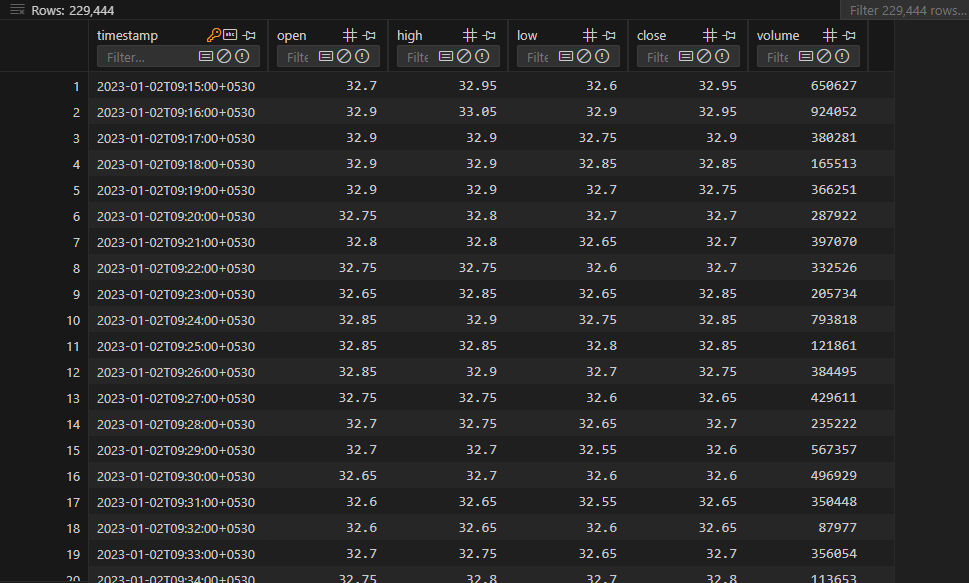

# Algorithmic Trading Bot

This algorithmic trading bot is a sophisticated and highly automated system designed to make trading decisions using deep learning and technical analysis. Operating in a real-time environment, it leverages an asynchronous, multi-threaded architecture to ensure responsiveness, fault tolerance, and efficient processing of market data.

---

## Features

* **End-to-End Automation**: Covers data fetching, feature engineering, model training, hyperparameter tuning, backtesting, and live trading.

* **Deep Learning Core**: Utilizes a robust TCN-BiLSTM-Attention neural network for predicting future price movements and generating trading signals.

* **Comprehensive Feature Engineering**: Incorporates a wide array of technical indicators (RSI, MACD, Bollinger Bands, Ichimoku, etc.) and candlestick patterns.

* **Adaptive Strategy**: Dynamically adjusts Stop-Loss (SL) and Take-Profit (TP) levels based on historical trade performance, enabling self-improvement.

* **Robust Risk Management**: Implements multiple layers of risk control, including maximum daily loss (fixed and percentage-based) and trade frequency limits.

* **Real-time Data Processing**: Connects to Upstox WebSocket feed for live tick data, aggregated into candles for timely signal generation.

* **Asynchronous & Resilient Design**: Built with `asyncio` for non-blocking operations, featuring API rate limiting, automatic reconnections, and state persistence.

* **Modular & Extensible**: Designed with distinct components for easy maintenance and future enhancements.

* **Local Data Storage**: Uses SQLite databases for efficient storage and retrieval of historical market data and trade logs.

* **CLI-Driven Interface**: Provides an interactive command-line interface for easy control over training, backtesting, and live trading.

* **Telegram Notifications**: Integrates with Telegram for real-time alerts and status updates.

* **Google Colab Ready**: Configured for easy deployment and execution within Google Colab environments.

---

## Architecture: The Overall Flow

The bot operates through several interconnected components, working in a robust supervisor-worker architecture to manage complex real-time trading operations.

### 1. Initialization and Configuration (Cells 0-2)

The initial phase sets up the bot's environment and loads all critical parameters:

* **Dependency Management (Cell 0)**: Automatically checks for and installs all necessary Python libraries (e.g., `pandas`, `numpy`, `tensorflow`, `upstox-python-sdk`, `python-telegram-bot`). It also defines crucial global constants like date formats, timezone, and class labels for trading actions ('BUY', 'HOLD', 'SELL').

* **Initial Setup & Configuration Loading (Cell 1)**:

  * **Comprehensive Imports**: Imports a wide range of standard, machine learning, and API-specific libraries.

  * **Custom IST Logger**: Initializes a custom logger that timestamps all messages in Indian Standard Time (IST), aligning with market hours.

  * **Telegram & Matplotlib**: Checks for Telegram bot availability and configures Matplotlib for non-interactive plotting.

  * **Upstox SDK Verification**: Validates the presence and functionality of the Upstox API SDK components, including protobuf modules for WebSocket data.

  * **Configuration Loading**: Loads operational parameters from a `config.yaml` file and environment variables. It prioritizes environment variables and then `config.yaml`, providing a flexible and secure way to manage API keys, trading symbols, model parameters, risk rules, and more.

  * **TensorFlow/GPU Setup**: Configures TensorFlow for optimal performance, including mixed precision training and XLA JIT compilation if GPUs are available and enabled in the configuration.

* **Global Configuration Variables (Cell 2)**: Centralizes the extraction of all critical operational parameters from the loaded `CONFIG` dictionary and environment variables into easily accessible global Python variables. This includes paths for data and models, API credentials, core trading parameters (symbols, intervals, lookback), model training settings (epochs, batch size, learning rate), technical indicator periods, strategy parameters (SL/TP, risk limits), backtesting settings, and live trading rules (market hours, order types, trade limits). It also initializes global state management dictionaries with `asyncio.Lock` for thread-safe access.

### 2. Data Management & Feature Engineering (Cells 3-4)

This stage is crucial for preparing raw market data into a format suitable for machine learning.

* **Feature Engineering (Cell 3)**:

  * **Technical Indicators**: The `add_technical_indicators` function calculates a comprehensive set of technical analysis indicators (e.g., Relative Strength Index (RSI), Moving Average Convergence Divergence (MACD), Bollinger Bands, Average True Range (ATR), Ichimoku Cloud) using the `ta` library.

  * **Candlestick Patterns**: The `add_candlestick_patterns` function identifies common candlestick patterns (e.g., Doji, Hammer, Engulfing) which serve as additional predictive features.

  * **Market Sentiment**: The `calculate_market_sentiment` function derives a sentiment label (Bullish, Bearish, Neutral) based on recent price and volume changes.

  * **Target Labeling**: The `generate_target_labels` function creates the classification target ('BUY', 'HOLD', 'SELL') by analyzing future price movements based on a configurable `classification_price_change_threshold` and `classification_lookahead_periods`.

* **Database Utilities (Cell 4)**:

  * **Historical Data Management**: The bot maintains a local SQLite database for each trading symbol. The `update_historical_data_in_db` function intelligently fetches the latest historical candle data from the Upstox API, merges it with existing records, and prunes old data to maintain a specified lookback period (`historical_data_lookback_days`), ensuring efficient and up-to-date local storage.

  * **Trade Log Processing**: The `process_symbol_trade_logs_for_learning` function processes past trade logs to extract key performance insights (win rate, PnL, SL/TP hit frequencies), which are vital for the strategy adaptation mechanism.

  * **Generic DB Operations**: Provides utility functions like `initialize_database_for_symbol`, `write_df_to_db`, `read_table_from_db`, and `append_record_to_db` for robust data persistence.

#### Database Screenshot

*Example of the Symbol Database Format.*


### 3. Model Training & Hyperparameter Tuning (Cell 5)

This cell encapsulates the machine learning pipeline, from model definition to robust training.

* **Model Architecture (`build_model`)**: The core prediction engine is a sophisticated Deep Learning model, specifically a **TCN-BiLSTM-Attention Network**. This architecture combines:

  * **Temporal Convolutional Networks (TCN)**: Effective at capturing local patterns and dependencies in time series data.

  * **Bidirectional LSTMs (BiLSTM)**: Process sequences in both forward and backward directions, enhancing the understanding of long-range dependencies.

  * **Attention Mechanisms**: Allow the model to dynamically focus on the most relevant parts of the input sequence.
    The model incorporates `BatchNormalization`, `LayerNormalization`, and `Dropout` for improved stability and generalization. It uses an `AdamW` optimizer and `sparse_categorical_crossentropy` loss for multi-class classification.

* **Custom Backtesting Callback (`CustomBacktestingCallback`)**: A unique Keras callback performs a lightweight backtest simulation on the validation data after each training epoch. This provides real-time insights into the model's actual trading performance (equity curve, returns) during training, helping to identify overfitting beyond just classification accuracy.

* **Single Model Training (`train_single_model_instance`)**: Manages the training of a single model instance, including:

  * **Data Preprocessing**: Applies `MinMaxScaler` for feature scaling and `LabelEncoder` for target encoding.

  * **Sequence Generation**: Transforms time series data into sequences suitable for the deep learning model.

  * **Class Weighting**: Addresses class imbalance (e.g., more 'HOLD' signals than 'BUY'/'SELL') by applying class weights during training.

  * **Callbacks**: Utilizes `ModelCheckpoint` to save the best model, `EarlyStopping` to prevent overfitting, and `ReduceLROnPlateau` for adaptive learning rate adjustments.

  * **Artifact Saving**: Saves the trained model, feature scaler, and label encoder to disk for later use.

* **Hyperparameter Tuning (`run_standalone_tuning_pipeline`)**: Integrates `keras-tuner` (e.g., `BayesianOptimization`) to efficiently search for optimal model hyperparameters (e.g., number of layers, units, learning rate) based on validation performance.

* **Advanced Training Pipeline (`run_adv_training_pipeline`)**: The main training entry point, supporting:

  * **K-Fold Cross-Validation**: If enabled, performs robust K-Fold cross-validation to train multiple models on different data splits, providing a more reliable performance estimate and fostering ensemble learning.

  * **Ensemble Training**: Can train multiple models for ensemble predictions in live trading.

  * **Retraining Logic**: Automatically re-enables symbols for live trading if they were previously halted due to poor performance, once successful retraining is confirmed.

### 4. Strategy Adaptation & Backtesting (Cells 6-7)

These cells enable the bot to simulate its performance and adapt its trading strategy based on learned insights.

* **Strategy Adaptation (`adapt_strategy_parameters_for_symbol`) (Cell 6)**: This is a core self-improvement mechanism. It dynamically adjusts the `current_sl_atr_multiplier` and `current_tp_atr_multiplier` (Stop-Loss and Take-Profit multipliers based on Average True Range) for each symbol. The adjustments are driven by the bot's observed performance from past live trades, specifically considering win rate, SL hit frequency, and TP hit frequency. This allows the bot to learn and optimize its risk-reward profile over time.

* **Simulation Backtesting (`run_simulation_backtest`) (Cell 6)**: Performs a detailed backtest simulation for a single symbol. It applies the model's predictions and the defined trading strategy rules (entry, exit, SL/TP management, position sizing) to historical data. It calculates a wide range of performance metrics, including:

  * Equity Curve, Profit and Loss (PnL)

  * Win Rate, Loss Rate, Average Gain/Loss

  * Maximum Drawdown, Average Trade Duration

  * Sharpe Ratio (risk-adjusted return)

* **Advanced Backtesting Pipeline (`run_adv_backtesting_pipeline`) (Cell 7)**: Provides a comprehensive backtesting framework to run simulations across multiple symbols.

  * **`run_backtest_for_single_symbol`**: Orchestrates the process for each symbol, loading relevant models and data, running the simulation, and calculating additional risk-adjusted metrics like Sortino Ratio (focuses on downside risk) and Calmar Ratio (drawdown-based).

  * **Aggregated Reporting**: Collects metrics from all backtested symbols into a summary table, providing a holistic view of the bot's simulated performance across the portfolio.

### 5. Live Trading, API Interactions & Real-time Processing (Cell 8)

This is the operational heart of the bot, managing real-time market interactions and trade execution.

* **Asynchronous Operations**: Leverages `asyncio` extensively to ensure non-blocking execution, critical for handling real-time market data streams and concurrent API calls without freezing the bot.

* **API Rate Limiter**: Implements a robust token bucket algorithm to strictly manage API call rates to the Upstox platform, preventing rate limit breaches and ensuring smooth operation.

* **State Persistence**: Crucially, the bot's internal state (current positions, order IDs, PnL, trade counts for each symbol, daily portfolio PnL) is periodically saved to and loaded from a `bot_state.json` file. This ensures that the bot can recover its state even after unexpected shutdowns or restarts.

* **Upstox API Client Initialization**: Handles the secure authentication and initialization of the Upstox API client, including loading access tokens from a file and verifying their validity.

* **Market Data Streamer (`start_upstox_market_data_streamer`)**:

  * Connects to the Upstox WebSocket feed to receive real-time tick-by-tick market data for subscribed symbols.

  * Decodes incoming protobuf messages.

  * Aggregates raw tick data first into 10-second "micro-candles" and then into 1-minute candles. These aggregated candles are then placed into a shared `candle_queue` for consumption by the signal processing tasks.

  * Includes robust WebSocket reconnection logic to handle disconnections gracefully.

* **Signal Processing & Order Management (`process_signal_for_symbol_live`, `place_order_upstox`)**:

  * Monitors the `candle_queue` for newly aggregated 1-minute candles.

  * Updates the symbol's historical data with the latest real-time candle.

  * Performs real-time feature engineering using the updated data.

  * Feeds the latest data sequence into the trained deep learning model to obtain predictions (BUY/SELL/HOLD signals).

  * Adds comprehensive checks to ensure the `atr` values used in live trading are valid and non-zero to prevent division by zero errors in SL/TP calculations.

  * Applies sophisticated trading strategy rules (e.g., confidence thresholds, risk management checks, trade frequency limits) to filter predictions and generate actionable trading signals.

  * Places entry and exit orders (LIMIT or MARKET) via the Upstox API. It manages the entire order lifecycle, including placement, modification, cancellation, and intelligent retries with rate limiting.

  * **Dynamic SL/TP Adjustments**: For active positions, it continuously monitors and dynamically adjusts Stop-Loss (SL) and Take-Profit (TP) levels based on the current ATR and the adaptively adjusted multipliers.

* **Risk Management & Position Monitoring**:

  * **Maximum Daily Loss**: Enforces both a global and per-symbol maximum daily loss limit (fixed amount or percentage of capital/margin). If this limit is hit, the bot automatically halts further trading for the day for that symbol or globally.

  * **Trade Frequency Limits**: Restricts the maximum number of trades allowed per day, both globally and per individual symbol, to prevent overtrading.

  * **Position Reconciliation**: Periodically checks the actual open positions reported by the broker against the bot's internal state. This ensures consistency and helps in recovering from potential discrepancies (e.g., if an order fill confirmation was missed).

  * **Trade Logging**: All trade entries, exits, and PnL are meticulously logged to the `trade_logs` database table for post-analysis and strategy adaptation.

* **Supervisor/Worker Architecture**: The live trading system is designed with a main supervisor loop that manages the lifecycle of multiple asynchronous worker tasks (e.g., data streamer, signal processors for each symbol, position monitor). This allows for highly concurrent and resilient operation.

* **Emergency Panic Button**: A dedicated `handle_panic_button_cli` function provides a safety mechanism. When activated, it attempts to liquidate all open positions, cancel all pending orders, and halt further trading, ensuring immediate de-risking in critical situations.

* **Market Hours Management**: All trading operations are strictly confined within predefined market hours (NSE time) to avoid off-hours trading.

### 6. Main Execution Block (Cell 9)

This cell provides the user interface for controlling the bot's various functionalities.

* **Command-Line Interface (CLI)**: Presents an interactive menu that allows the user to:

  1. Load & Preprocess Data

  2. Run Hyperparameter Tuning

  3. Run Model Training (including K-Fold or ensemble)

  4. Run Advanced Backtesting (multi-symbol, detailed metrics)

  5. Start Live Trading

  6. Activate the Panic Button

  7. Exit the bot

* **`nest_asyncio`**: Used to enable `asyncio.run()` to be called within an existing event loop, common in environments like Jupyter notebooks or Google Colab.

* **Input Handling & Validation**: Prompts the user for choices and includes basic validation.

* **Asynchronous Task Management**: Uses `asyncio.create_task` and `asyncio.gather` to concurrently manage different operational tasks, especially during live trading where market data streaming and signal processing run simultaneously.

* **State Locking**: Employs `asyncio.Lock` (`bot_state_lock`) to protect shared global state variables from race conditions when multiple asynchronous tasks access them.

* **Prerequisite Checks**: Ensures that necessary conditions are met (e.g., models are trained before starting live trading).

* **Robust Error Handling**: Includes comprehensive `try-except` blocks to gracefully handle `KeyboardInterrupt` (user-initiated termination) and other `RuntimeError` or general `Exception` types, providing informative messages and ensuring a clean shutdown.

* **Telegram Notifications**: Sends real-time Telegram messages to keep the user informed about critical events, such as the start/end of operations, successful training, or encountered errors.

---

## Key Technical Details

* **Deep Learning Model**: A custom TCN-BiLSTM-Attention network (built with TensorFlow/Keras) specifically designed for time series prediction in financial markets.

* **Risk Management**: Multi-layered: maximum daily loss (fixed and percentage), maximum trades per day (global and per-symbol), dynamic Stop-Loss/Take-Profit.

* **Adaptive Strategy**: SL/TP multipliers are dynamically adjusted based on the bot's actual trade performance metrics (win rate, SL/TP hit rates) derived from live trade logs.

* **Asynchronous & Resilient Design**: Leverages Python's `asyncio` for non-blocking I/O, ensuring responsiveness. Includes API rate limiting (token bucket), automatic WebSocket reconnections, and state persistence for fault tolerance.

* **Data Storage**: Utilizes SQLite databases for efficient local storage of historical market data and trade logs, accessible via Pandas DataFrames.

* **Monitoring & Alerts**: Integrated logging (IST timestamps) and Telegram notifications for real-time operational transparency.

## Folder Structure

The algorithmic trading bot is designed with a clear folder structure to organize its various components, data, and artifacts. This structure is primarily defined and managed through the `config.yaml` file and the `BASE_PROJECT_PATH` variable.


**Explanation of the folders:**

* **`<BASE_PROJECT_PATH>`**: This is the **root directory** for the entire project. All other relative paths within the bot's configuration and code are resolved against this base path.

  * Its location can be configured in your `config.yaml` file under `directory_paths` (e.g., `base_project_path: "/path/to/your/project"`), or it can be set via an environment variable named `BASE_PROJECT_PATH`.

  * In Google Colab environments, it often defaults to a path within your Google Drive, such as `/content/drive/MyDrive/main`.

  * **Files directly under `<BASE_PROJECT_PATH>`:**

    * **`config.yaml`**: The primary configuration file for the bot, detailing API keys, trading parameters, model settings, etc.

    * **`upstox_access_token.json`**: This file stores the Upstox API access token after successful authentication. It resides directly in the base path, not nested in `other_files`, for direct access by the bot.

    * **`bot_state.json`**: This file persists the bot's live trading state across sessions, including current positions, PnL, and trade counts, enabling seamless restarts.

    * **`README.md`**: This document, providing a detailed description and guide for the bot.

    * **`Algorithmic_trading_bot.ipynb`**: The Jupyter Notebook containing the bot's entire codebase.

* **`data_historical/`**: Configured by `historical_data_dir` in `config.yaml`.

  * This directory stores SQLite database files (e.g., `IRFC.db`, `IRB.db`) for each trading symbol. Each database contains historical candle data, live trade logs (`trade_logs`), backtest logs (`backtest_logs`), and augmented data logs (`augmented_logs`) for its respective symbol.

* **`models/`**: Configured by `models_artefacts_dir` in `config.yaml`.

  * This directory stores the trained deep learning models (in `.keras` or `.h5` format), their corresponding feature scalers (`MinMaxScaler` saved as `.pkl`), and label encoders (`LabelEncoder` saved as `.pkl`). Each symbol typically has its own sub-directory, and models are saved with unique identifiers (like timestamps or fold numbers) to manage different training runs or ensemble members.

* **`results_tuning/`**: Configured by `tuning_results_dir` in `config.yaml`.

  * This directory stores the results and logs from hyperparameter tuning runs conducted using Keras Tuner. It helps in tracking and analyzing different hyperparameter combinations and their performance.

* **`other_files/`**: Configured by `other_files_dir` in `config.yaml`.

  * This is a general-purpose directory for any other miscellaneous files the bot might generate or use that don't fit into the more specific `data_historical`, `models`, or `results_tuning` categories.

This organized structure ensures that data, models, and configurations are kept separate and easily manageable, which is crucial for a complex algorithmic trading system.

---

## Setup and Installation

1. **Clone the Repository**:
```
git clone https://github.com/udhay8005/Algorithmic-trading-bot.git
cd algo-trading-bot
```

2. **Configuration**:

* Rename `config_template.yaml` to `config.yaml`.

* Edit `config.yaml` to set your Upstox API keys, trading symbols, model parameters, and risk management rules.

* Set `BASE_PROJECT_PATH` in `config.yaml` or as an environment variable to point to your desired base directory for data, models, etc. (e.g., `/content/drive/MyDrive/main` for Google Colab).

3. **Dependencies**: The bot includes an automatic dependency checker (Cell 0) that will install necessary libraries.

* Ensure you have `pip` installed.

* If using Google Colab, the environment is generally ready.

4. **Upstox API Authentication**:

* Obtain your Upstox API key and secret.

* The bot will manage the access token. It's recommended to set `access_token_file` in `config.yaml` and let the bot save/load tokens, rather than hardcoding.

5. **Telegram Bot (Optional)**: If you want Telegram notifications, create a Telegram bot and get its API token and your chat ID. Configure these in `config.yaml`.

---

## Usage

To run the bot, simply execute the `Algorithmic_trading_bot.ipynb` notebook cells sequentially.

The `Main Execution Block` (Cell 9) will present an interactive command-line menu:
```
====================================================
      🤖 ADVANCED MULTI-SYMBOL TRADING BOT 🤖      
====================================================

--- 🤖 Bot Operations Menu & Status (2025-06-21 19:28:37 IST) ---
Active Symbols: IRFC
Target Interval: 1minute, Auto Orders: DISABLED (Alerts Only)
Capital Mode: EQUAL (Use [C] to toggle)

--- Portfolio Status ---
  Trading Mode: Not Set (Run Live Trading)
  Margin: Not fetched/Zero
  Max Daily Loss Limit: ₹400.00
  Today's Portfolio Net P&L: ₹0.00
  Portfolio Trades Today: 0 / N/A
  Max Trades Per Symbol: 2
  Global Trading Halted: NO
  New Entries Allowed: YES

--- Symbol-Specific Status ---
  - IRFC: Pos:None, Trades:0/2, PNL:₹0.00, Halt(Perf):NO(0d), SLM:1.00, TPM:2.00
------------------------------------------------------------------------
  [1] Load & Preprocess Data          [P] Process Symbol Trade Logs
  [2] Tune Hyperparameters            [S] Adapt Symbol Strategy Params  
  [3] Train Model(s) 
  [4] Backtest Model(s) 
------------------------------------------------------------------------
  [5] Live Trading (ALERTS ONLY)      [7] Get Current Positions (Upstox)
  [6] Live Trading (AUTO ORDERS)      [8] Get Funds & Margin (Upstox)
------------------------------------------------------------------------
  [9] Change Symbol Selection         [C] Toggle Capital Allocation Mode
  [X] PANIC! -> Close All Positions   [0] Exit Program
------------------------------------------------------------------------
Enter your choice:
```

Follow the prompts to train models, run backtests, or start live trading.

---

## Disclaimer

Trading in financial markets carries a high level of risk, and is not suitable for all investors. The high degree of leverage can work against you as well as for you. Before deciding to invest in financial markets you should carefully consider your investment objectives, level of experience, and risk appetite. The possibility exists that you could sustain a loss of some or all of your initial investment and therefore you should not invest money that you cannot afford to lose. You should be aware of all the risks associated with financial market trading, and seek advice from an independent financial advisor if you have any doubts. This algorithmic trading bot is provided for educational and informational purposes only, and should not be considered financial advice. Past performance is not indicative of future results.

@UdhayaChandra